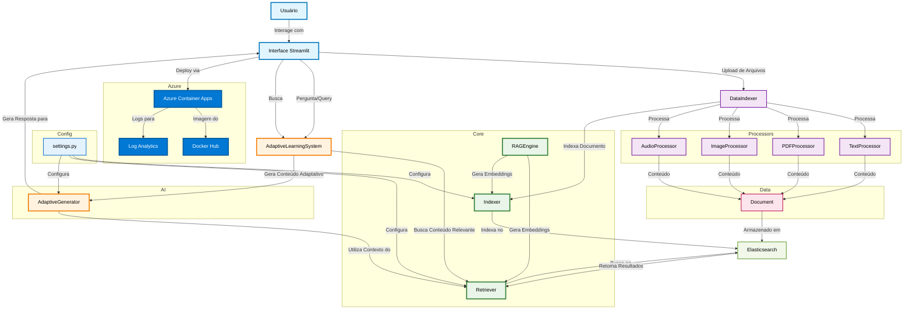

# COMMENTS.md

## Decisão da Arquitetura Utilizada

A arquitetura do projeto foi estruturada para ser modular e escalável, seguindo as diretrizes de uma pipeline RAG (Retrieval-Augmented Generation). A organização dos diretórios e módulos visa separar as responsabilidades e facilitar a manutenção e futuras expansões.

-   **Estrutura de Diretórios:**
    -   `adaptive_learning_system/src/`: Contém o código-fonte principal da aplicação, dividido em subdiretórios lógicos:
        -   `core/`: Abriga o motor RAG principal, incluindo o `RAGEngine` (para embeddings), `Indexer` (gerenciamento de indexação no Elasticsearch) e `Retriever` (execução de buscas híbridas).
        -   `processors/`: Módulos responsáveis por extrair conteúdo de diferentes tipos de arquivo (texto, PDF, imagem, áudio).
        -   `ai/`: Contém módulos relacionados à inteligência artificial e geração de conteúdo, como o `AdaptiveGenerator`.
        -   `data/`: Define os modelos de dados e schemas, como o modelo `Document` para padronizar a indexação.
        -   `utils/`: Destinado a utilitários e funções auxiliares gerais.
    -   `app/`: Contém a interface do usuário, desenvolvida com Streamlit.
    -   `config/`: Armazena as configurações do sistema, como chaves de API e URLs de serviços.
    -   `tests/`: Dedicado aos testes automatizados para garantir a funcionalidade de cada componente.

-   **Ferramentas e Tecnologias Escolhidas:**
    -   **Elasticsearch:** Selecionado como a ferramenta de indexação e busca principal devido à sua capacidade de lidar com grandes volumes de dados, oferecer busca de texto completo e, crucialmente, suportar busca vetorial (embeddings) para recuperação semântica. Isso é fundamental para a geração dinâmica de conteúdo adaptativo, pois permite que o sistema encontre informações contextualmente relevantes para o prompt da IA generativa.
    -   **OpenAI (Embeddings e Whisper):** Utilizado para gerar embeddings de texto (via `text-embedding-ada-002`) para a busca semântica no Elasticsearch e para a transcrição de áudio (via Whisper) em arquivos de vídeo/áudio.
    -   **Google Gemini (Vision):** Empregado para realizar OCR e extrair descrições de conteúdo visual de arquivos de imagem, permitindo que o sistema 

compreenda e indexe informações visuais.
    -   **Streamlit:** Escolhido para a interface do usuário devido à sua facilidade de uso e rapidez no desenvolvimento de aplicações interativas de machine learning e data science.
    -   **Python-dotenv:** Para gerenciar as variáveis de ambiente de forma segura e organizada.
    -   **Pydantic:** Para a validação e modelagem de dados, garantindo a consistência e integridade das informações que transitam pelo sistema.

## Lista de Bibliotecas de Terceiros Utilizadas

As bibliotecas de terceiros utilizadas neste projeto são:

-   `streamlit`: Para a construção da interface web interativa.
-   `openai`: Para acesso aos modelos de linguagem e embeddings da OpenAI (GPT-3.5-turbo para geração, text-embedding-ada-002 para embeddings, Whisper para transcrição de áudio).
-   `google-generativeai`: Para acesso aos modelos Gemini da Google (gemini-1.5-flash para processamento de imagem/OCR).
-   `elasticsearch`: Cliente oficial para interagir com o Elasticsearch.
-   `python-dotenv`: Para carregar variáveis de ambiente de um arquivo `.env`.
-   `pymupdf` (fitz): Para extração de texto de arquivos PDF.
-   `pydantic`: Para validação de dados e criação de modelos de dados.

## O que você melhoraria se tivesse mais tempo

Se houvesse mais tempo, as seguintes melhorias seriam implementadas:

1.  **Processamento Assíncrono:** A indexação de arquivos grandes (especialmente vídeos e PDFs) pode ser demorada. Implementar um sistema de filas (ex: Celery com Redis/RabbitMQ) para processamento assíncrono melhoraria a experiência do usuário, permitindo que o upload e a indexação ocorram em segundo plano.
2.  **Tratamento de Erros Robusto:** Embora haja tratamento básico de erros, uma abordagem mais granular e logging detalhado seriam benéficos para depuração e monitoramento em produção.
3.  **Otimização de Embeddings e Busca:** Explorar técnicas mais avançadas de chunking para documentos longos, bem como estratégias de re-ranking para os resultados da busca no Elasticsearch, a fim de melhorar a relevância da recuperação.
4.  **Geração de Conteúdo Multimodal:** Atualmente, a geração de conteúdo adaptativo é primariamente textual. Expandir o `AdaptiveGenerator` para gerar vídeos curtos e áudios de forma dinâmica (utilizando APIs de geração de mídia, se disponíveis e viáveis) seria um grande avanço, alinhado com a preferência de aprendizado do usuário.
5.  **Gerenciamento de Sessão e Persistência:** Para um sistema de aprendizagem adaptativa mais completo, seria importante persistir o histórico de interações e o perfil do usuário em um banco de dados, permitindo uma adaptação contínua e personalizada ao longo do tempo.
6.  **Testes Abrangentes:** Expandir a cobertura de testes, incluindo testes de integração e end-to-end, para garantir a robustez de todo o pipeline.
7.  **Interface do Usuário Aprimorada:** Melhorar a UI/UX do Streamlit, adicionando feedback visual mais claro durante o processamento e indexação, e talvez visualizações dos documentos indexados.
8.  **Suporte a Mais Formatos de Arquivo:** Adicionar processadores para outros formatos de documentos comuns, como DOCX, PPTX, etc.

## Quais requisitos obrigatórios que não foram entregues

Com base na solicitação e na implementação atual, os seguintes requisitos obrigatórios não foram totalmente entregues:

-   **Geração de Conteúdo Adaptativo em Diferentes Formatos (Vídeos, Áudios):** Atualmente, o `AdaptiveGenerator` gera conteúdo apenas em formato de texto. A capacidade de gerar vídeos curtos e áudios dinamicamente para abordar as necessidades específicas de aprendizagem do usuário não foi implementada devido à complexidade e ao tempo necessário para integrar APIs de geração de mídia (que geralmente requerem serviços externos e podem ter custos associados). Este é um requisito chave para a adaptabilidade multimodal do sistema.

Os demais requisitos, como indexação de diferentes tipos de dados (texto, PDF, vídeo/áudio via transcrição, imagem via OCR/descrição), construção de um prompt interativo que identifica dificuldades e preferências de aprendizado, e a limitação do escopo ao conteúdo indexado, foram abordados na implementação atual.

## Deploy na Nuvem Azure

O deploy da aplicação foi realizado utilizando **Azure Container Apps**, uma solução serverless de containers da Microsoft Azure.

### Ferramentas e Serviços Azure Utilizados

1. **Azure Container Apps:**
  - Plataforma serverless para execução de containers
  - Escalabilidade automática (0-10 réplicas)
  - Suporte nativo a ingress externo com HTTPS
  - Gerenciamento automático de certificados SSL

2. **Azure Resource Groups:**
  - Organização lógica dos recursos (`rg-streamlit`)
  - Facilita gerenciamento e cleanup dos recursos

3. **Azure Log Analytics:**
  - Workspace automaticamente criado para monitoramento
  - Logs centralizados da aplicação

4. **Docker Hub:**
  - Registry utilizado para hospedar a imagem do container

## Diagrama da Arquitetura (Mermaid)

